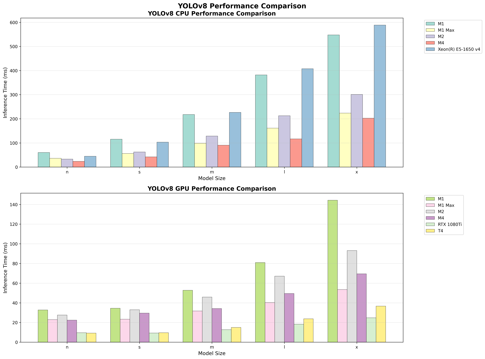
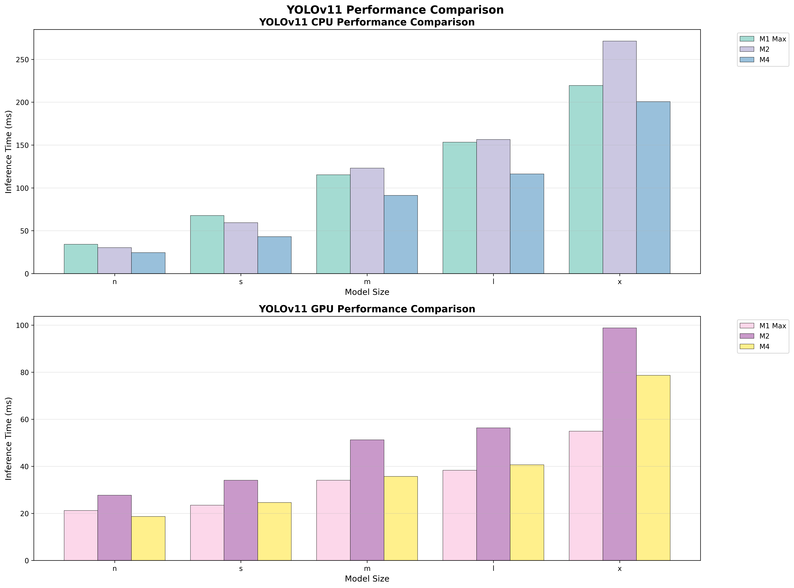
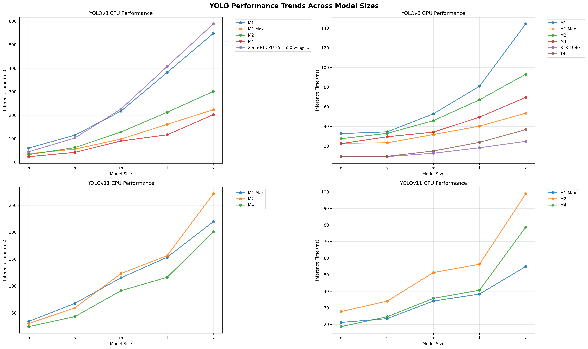

# YOLOBench


YOLOBench is a benchmarking python script for YOLO. , especially video image inference. It is designed to be easy to use and to provide a consistent and reproducible benchmarking environment. 

# Getting Started
YOLOBench uses Ultralytics' YOLOv8 as a backend. You need to install YOLOv8 first. 

## Setup Ultralytics' YOLOv8
 * ultralytics quick start https://docs.ultralytics.com/ja/quickstart/#install-ultralytics

## Clone YOLOBench
```
git clone https://github.com/TetsuakiBaba/YOLOBench.git
``` 

## Run YOLOBench
```
cd YOLOBench
python3 benchmark.py
```

### Command Line Options
YOLOBench supports command line arguments to customize the benchmarking process:

```bash
# Run with default device (CPU)
python3 benchmark.py

# Run on Apple Silicon GPU
python3 benchmark.py --device mps

# Run on CUDA GPU (if available)
python3 benchmark.py --device cuda:0

# Run on specific CUDA GPU
python3 benchmark.py --device cuda:1

# Show help for available options
python3 benchmark.py --help
```

Available devices:
- `cpu`: CPU inference - default
- `mps`: Apple Silicon GPU (Metal Performance Shaders)
- `cuda:0`, `cuda:1`, etc.: NVIDIA CUDA GPU inference

## Visualizing Results

You can generate comprehensive graphs from the benchmark results using the included visualization script:

```bash
# Install visualization dependencies
pip install -r requirements_viz.txt

# Generate comprehensive performance graphs
python3 visualize_results.py
```

This will create optimized graph files:
- `yolov8_comprehensive_performance.png` - Complete YOLOv8 performance overview (CPU & GPU)
- `yolov11_comprehensive_performance.png` - Complete YOLOv11 performance overview (CPU & GPU)  
- `yolo_performance_trends.png` - Performance trends across model sizes for all configurations

The graphs use:
- **Grouped bar charts** with linear scale for intuitive performance comparison
- **Line charts** showing performance trends as model complexity increases
- **Separate CPU/GPU sections** for clear distinction between device types
- **Shortened architecture names** for better readability

### Generated Visualizations

#### YOLOv8 Performance Overview


#### YOLOv11 Performance Overview


#### Performance Trends Analysis


# Benchmark Results
object detection inference [ms] (lower is better)

## yolov8 
| ARCH | CPU/GPU | n | s | m | l | x |
| --- | --- | --- | --- | --- | --- | --- |
| Apple M1 | CPU | 60.3 | 115.3 | 217.6 | 381.9 | 547.9 |
| Apple M1 | GPU | 32.7 | 34.5 | 52.8 | 80.9 | 144.3 |
| Apple M1 Max  | CPU | 36.3 | 55.9 | 98.7 | 161.3 | 223.5 |
| Apple M1 Max | GPU | 22.88 | 23.3 | 31.75 | 40.29 | 53.44 |
| Apple M2 | CPU | 32.74 | 62.23 | 128.62 | 212.7 | 301.15 |
| Apple M2 | GPU | 27.53 | 32.94 | 45.87 | 67.1 | 93.06 |
| Apple M4 | CPU | 23.63 | 42.07 | 90.39 | 116.77 | 202.34 |
| Apple M4 | GPU | 22.46 | 29.5 | 34.18 | 49.43 | 69.51 |
| Intel(R) Xeon(R) CPU E5-1650 v4 @ 3.60GHz | CPU | 44.5 | 103.2 | 226.5 | 407.4 | 588.6 |
| NVIDIA RTX 1080Ti  | GPU | 9.6 | 9.3 | 12.7 | 18.3 | 24.8 |
| NVIDIA T4  | GPU | 9.2 | 9.6 | 15.0 | 23.8 | 36.7 |

## yolov11
| ARCH | CPU/GPU | n | s | m | l | x |
| --- | --- | --- | --- | --- | --- | --- |
| Apple M1 Max | CPU | 34.13 | 67.7 | 115.25 | 153.36 | 219.54 |
| Apple M1 Max | GPU | 21.2 | 23.48 | 34.1 | 38.33 | 54.95 |
| Apple M2 | CPU | 30.23 | 59.37 | 123.1 | 156.35 | 271.28 |
| Apple M2 | GPU | 27.74 | 34.06 | 51.29 | 56.32 | 98.83 |
| Apple M4 | CPU | 24.56 | 43.12 | 91.29 | 116.18 | 200.67 |
| Apple M4 | GPU | 18.67 | 24.64 | 35.71 | 40.63 | 78.68 |


## Thanks
  * by Free Videos: https://www.pexels.com/ja-jp/video/854100/